# 📚 Documentation Complète - Terraform vSphere Talos

> **Projet**: Déploiement automatisé d'un cluster Kubernetes Talos Linux sur VMware vSphere
> 
> **Auteur**: ClemCreator
> 
> **Date**: 20 Octobre 2025

---

## 📋 Table des Matières

1. [Vue d'Ensemble](#-vue-densemble)
2. [Architecture Globale](#-architecture-globale)
3. [Architecture Réseau](#-architecture-réseau)
4. [Composants Terraform](#-composants-terraform)
5. [Stack Applicative](#-stack-applicative)
6. [Flux de Déploiement](#-flux-de-déploiement)
7. [Structure des Fichiers](#-structure-des-fichiers)
8. [Versions et Dépendances](#-versions-et-dépendances)
9. [Sécurité et Certificats](#-sécurité-et-certificats)
10. [Guide d'Utilisation](#-guide-dutilisation)

---

## 🎯 Vue d'Ensemble

Ce projet automatise le déploiement d'un cluster Kubernetes basé sur **Talos Linux** dans un environnement VMware vSphere. Il utilise Terraform pour l'infrastructure as code et déploie automatiquement une stack complète d'applications.

### Objectifs Principaux

- ✅ **Infrastructure as Code** : Tout est versionné et reproductible
- ✅ **Sécurité** : Gestion automatique des certificats TLS via cert-manager
- ✅ **Observabilité** : Hubble UI pour la visualisation du réseau
- ✅ **GitOps** : Argo CD pour le déploiement continu (App of Apps pattern)
- ✅ **Storage Persistant** : DRBD + LINSTOR + Piraeus Operator
- ✅ **WebAssembly** : Support des applications Spin (Wasm)

### 🚀 Nouveauté : Architecture GitOps

Ce projet implémente le pattern **"App of Apps"** d'ArgoCD pour une gestion déclarative et automatisée des applications :

```
Git Repository (Source of Truth)
        ↓
    Terraform Bootstrap
        ↓
    ┌─────────────────┐
    │   app-root      │  ← Application racine ArgoCD
    │  (App of Apps)  │
    └────────┬────────┘
             ↓
    ┌────────┴────────┐
    │  manifests/apps │
    └────────┬────────┘
             ↓
    ┌────────┴────────────────┐
    │  Applications ArgoCD    │
    ├─────────────────────────┤
    │  • gitea                │
    │  • trust-manager        │
    │  • reloader             │
    └─────────────────────────┘
```

**Avantages** :
- 🔄 Sync automatique depuis Git
- 📊 Visibilité complète dans l'UI ArgoCD
- ↩️ Rollback facile (git revert)
- 🔒 Self-healing automatique
- ➕ Ajout d'applications simplifié

---

## 🏗️ Architecture Globale

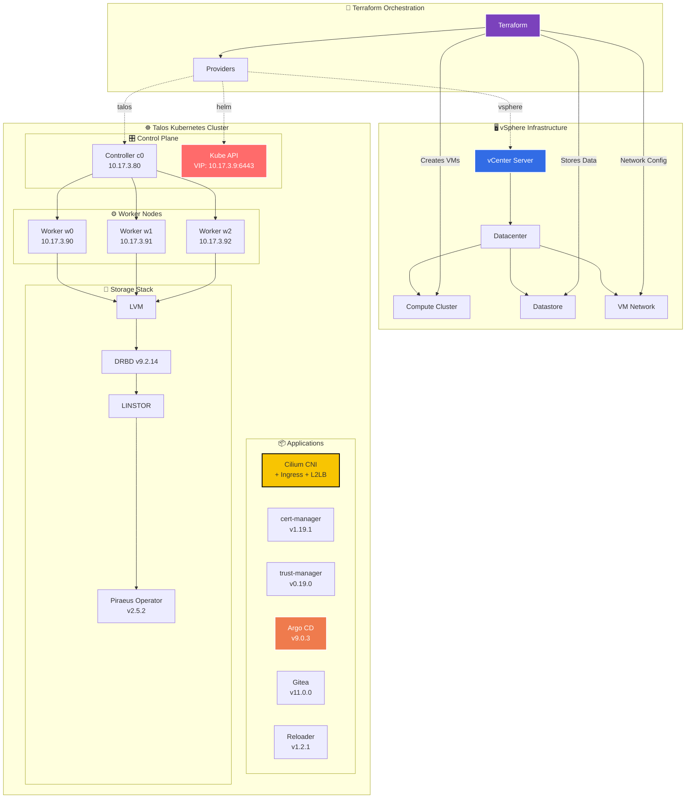

---

## 🌐 Architecture Réseau

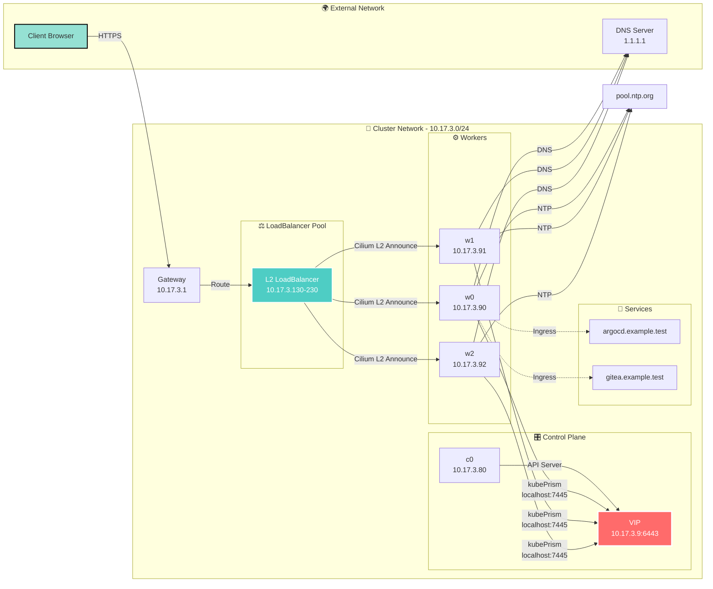

---

## 🔧 Composants Terraform

### Providers Utilisés

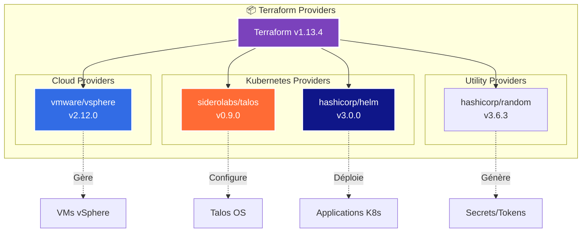

### Structure des Fichiers Terraform

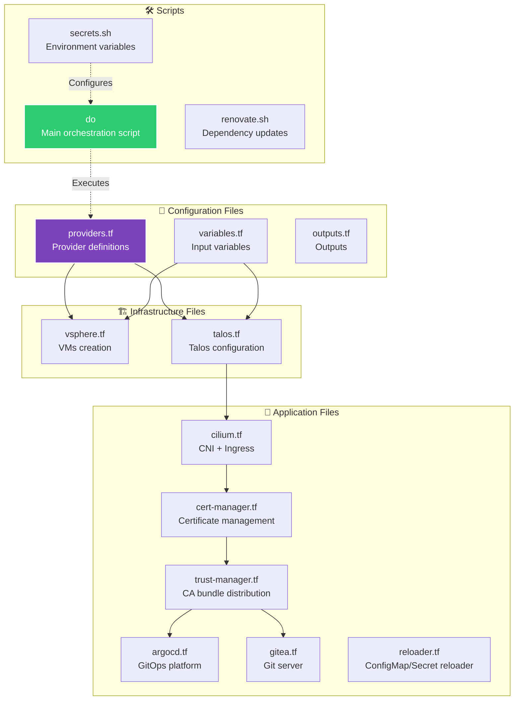

---

## 📦 Stack Applicative

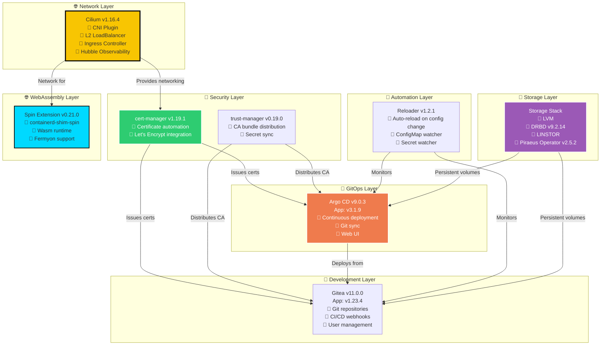

---

## 🔄 Flux de Déploiement

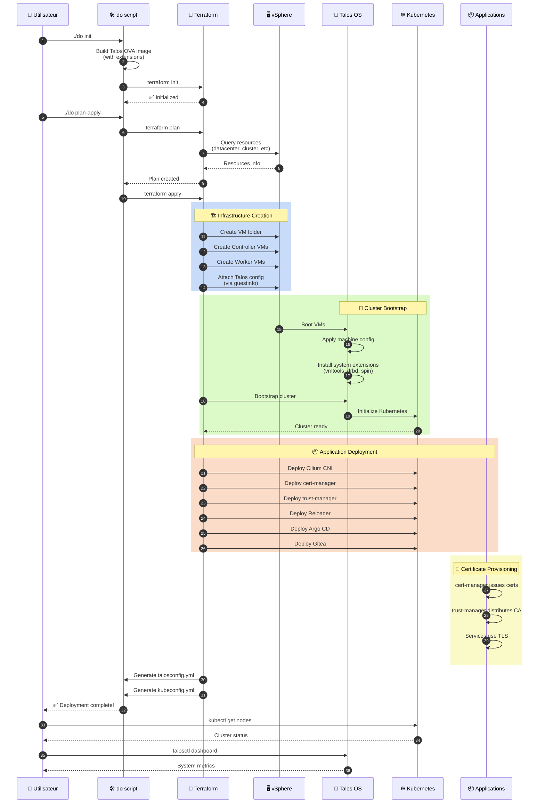

---

## 📂 Structure des Fichiers

```
terraform-vsphere-talos/
│
├── 📄 Terraform Configuration
│   ├── providers.tf              # Définition des providers
│   ├── variables.tf              # Variables d'entrée
│   ├── outputs.tf                # Outputs (kubeconfig, talosconfig)
│   ├── vsphere.tf               # Création des VMs
│   ├── talos.tf                 # Configuration Talos (inline manifests)
│   └── manifests-bootstrap.tf   # 🆕 Bootstrap ArgoCD app-root
│
├── 🎨 Applications (Terraform Helm Templates)
│   ├── cilium.tf                # CNI + Ingress + L2 LB
│   ├── cert-manager.tf          # Gestion des certificats
│   ├── trust-manager.tf         # Distribution des CA (template only)
│   ├── argocd.tf                # GitOps platform
│   ├── gitea.tf                 # Serveur Git (template only)
│   └── reloader.tf              # Auto-reload configs (template only)
│
├── 📦 Manifests GitOps (🆕 ArgoCD)
│   ├── README.md                # Documentation manifests
│   ├── apps/                    # Applications ArgoCD
│   │   ├── kustomization.yaml
│   │   ├── gitea.yaml          # App definition
│   │   ├── trust-manager.yaml  # App definition
│   │   └── reloader.yaml       # App definition
│   ├── bootstrap/              # Bootstrap manifests
│   │   └── app-root.yaml       # App of Apps racine
│   ├── gitea/                  # Gitea Helm config
│   │   ├── kustomization.yaml
│   │   ├── values.yaml
│   │   └── certificate.yaml
│   ├── trust-manager/          # trust-manager config
│   │   ├── kustomization.yaml
│   │   └── values.yaml
│   └── reloader/               # reloader config
│       ├── kustomization.yaml
│       └── values.yaml
│
├── 🛠️ Scripts
│   ├── do                       # Script principal d'orchestration
│   ├── secrets.sh               # Variables d'environnement
│   ├── argocd-helper.sh         # 🆕 Helper ArgoCD
│   ├── validate.sh              # 🆕 Validation pre-deploy
│   ├── renovate.sh              # Mise à jour des dépendances
│   └── renovate.json5           # Configuration Renovate
│
├── 📋 Configuration
│   ├── .tflint.hcl              # Linter Terraform
│   ├── .gitignore               # Fichiers ignorés
│   └── .github/                 # GitHub Actions (CI/CD)
│
├── 📁 Runtime Files (Generated)
│   ├── talosconfig.yml          # Configuration Talos CLI
│   ├── kubeconfig.yml           # Configuration kubectl
│   ├── terraform.tfstate        # État Terraform
│   └── tmp/                     # Fichiers temporaires
│       └── talos/               # Images Talos OVA
│
└── 📚 Documentation
    ├── README.md                # Documentation principale
    ├── DOCUMENTATION.md         # Ce fichier
    ├── MIGRATION-GUIDE.md       # 🆕 Guide de migration GitOps
    ├── CHANGELOG.md             # 🆕 Historique des changements
    └── example*.yml             # Exemples de manifests
```

### 🔄 Flux de Déploiement des Applications

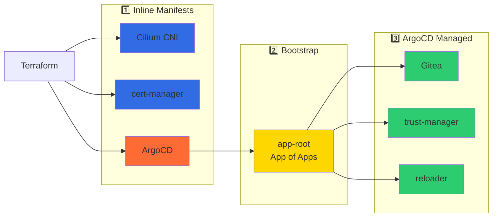

---

## 📊 Versions et Dépendances

### Versions Actuelles

| Composant | Version Chart | Version App | Date Release |
|-----------|--------------|-------------|--------------|
| **Infrastructure** |
| Terraform | 1.13.4 | - | - |
| Talos Linux | 1.11.3 | - | Oct 2025 |
| Kubernetes | 1.34.1 | - | Oct 2025 |
| **Providers** |
| vSphere Provider | 2.12.0 | - | Avr 2025 |
| Talos Provider | 0.9.0 | - | - |
| Helm Provider | 3.0.0 | - | Juin 2025 |
| Random Provider | 3.6.3 | - | - |
| **Applications** |
| Cilium | 1.16.4 | - | - |
| cert-manager | 1.19.1 | - | Oct 2025 |
| trust-manager | 0.19.0 | - | Août 2025 |
| Argo CD | 9.0.3 | v3.1.9 | Sept 2025 |
| Gitea | 11.0.0 | 1.23.4 | - |
| Reloader | 1.2.1 | - | Sept 2025 |
| **Extensions** |
| VMtools Guest Agent | 1.4.0 | - | - |
| DRBD | 9.2.14 | - | - |
| Spin Runtime | 0.21.0 | - | - |
| Piraeus Operator | 2.5.2 | - | - |

### Dépendances

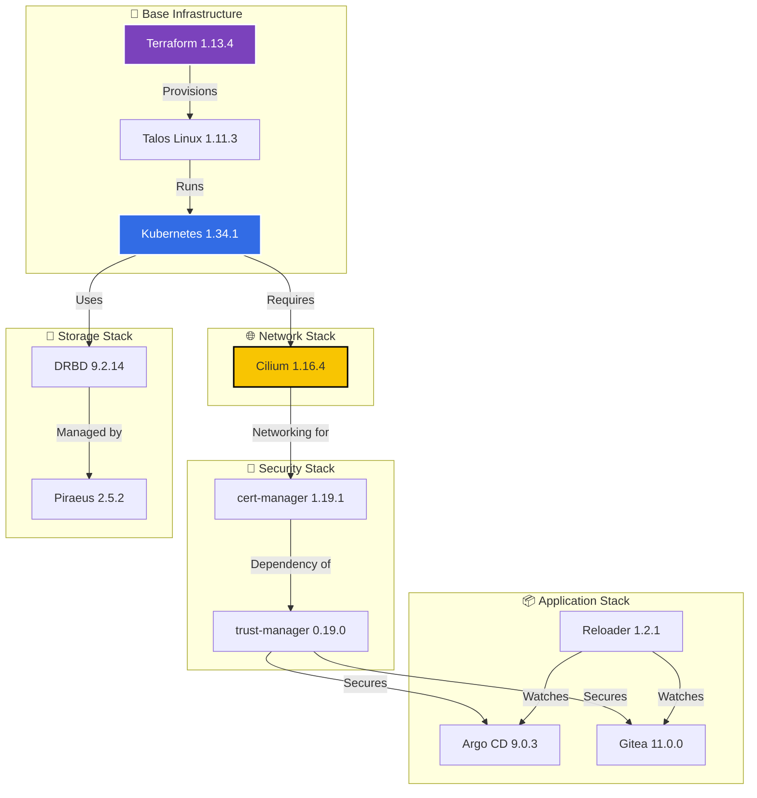

---

## 🔐 Sécurité et Certificats

### Architecture de Sécurité

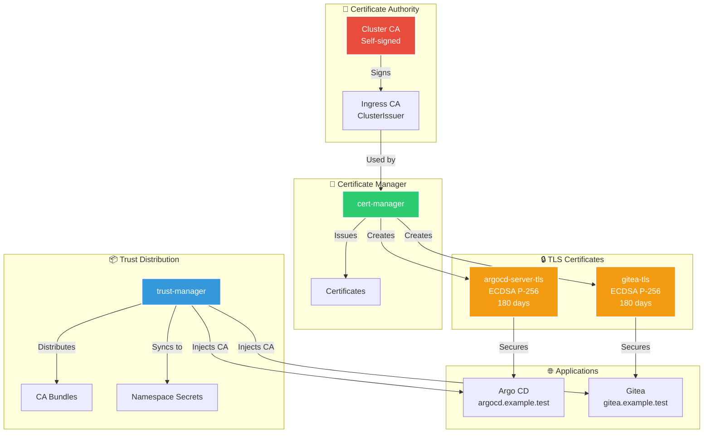

### Caractéristiques de Sécurité

#### 🔒 Certificats TLS
- **Algorithme**: ECDSA P-256 (compatibilité navigateurs modernes)
- **Durée de vie**: 180 jours (rotation automatique à 90 jours)
- **Émetteur**: ClusterIssuer "ingress"
- **Renouvellement**: Automatique via cert-manager

#### 🛡️ Fonctionnalités
- ✅ TLS end-to-end pour tous les services exposés
- ✅ Distribution automatique des CA bundles
- ✅ Rotation automatique des certificats
- ✅ Synchronisation des secrets entre namespaces
- ✅ Validation des certificats avant renouvellement

---

## 🚀 Guide d'Utilisation

### Prérequis

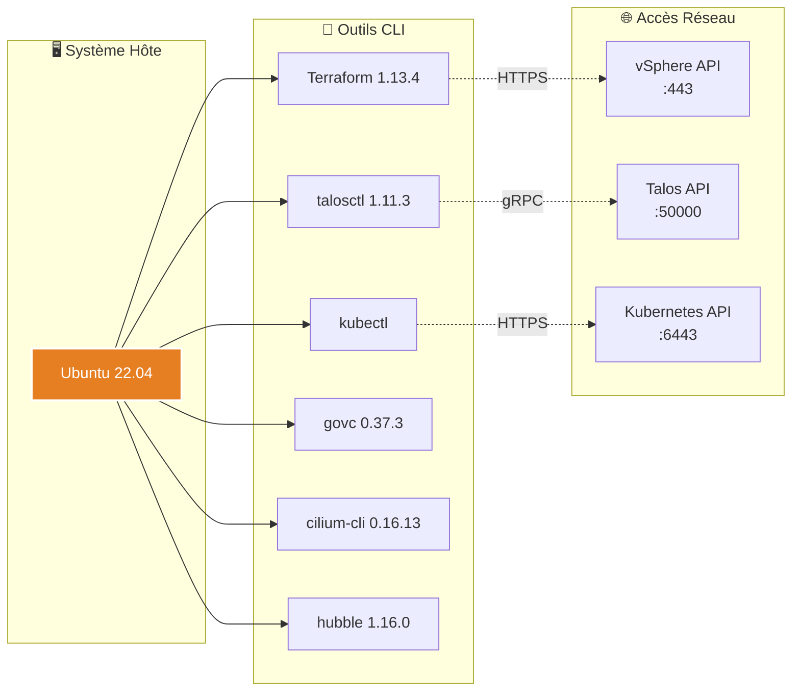

### Workflow de Déploiement

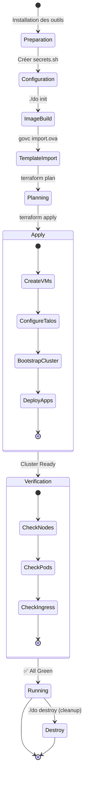

### Commandes Principales

#### 1️⃣ Installation Initiale

```bash
# Charger les variables d'environnement
source secrets.sh

# Initialiser (build image + terraform init)
./do init

# Importer le template dans vSphere
govc import.ova \
  -ds $TF_VAR_vsphere_datastore \
  -name "talos-1.11.3-amd64" \
  tmp/talos/talos-1.11.3-vmware-amd64.ova
```

#### 2️⃣ Déploiement

```bash
# Plan et Apply en une commande
./do plan-apply

# OU séparément
./do plan
./do apply
```

#### 3️⃣ Vérification

```bash
# Exporter les configs
export TALOSCONFIG=$PWD/talosconfig.yml
export KUBECONFIG=$PWD/kubeconfig.yml

# Vérifier Talos
talosctl -n $(terraform output -raw controllers) version
talosctl -n $(terraform output -raw controllers) dashboard

# Vérifier Kubernetes
kubectl get nodes -o wide
kubectl get pods -A

# Vérifier Cilium
cilium status
cilium connectivity test
```

#### 4️⃣ Accès aux Applications

```bash
# Argo CD
echo "https://argocd.example.test"
kubectl -n argocd get secret argocd-initial-admin-secret \
  -o jsonpath="{.data.password}" | base64 -d

# Gitea
echo "https://gitea.example.test"

# Hubble UI (Port-forward)
cilium hubble ui
```

#### 5️⃣ Nettoyage

```bash
# Détruire l'infrastructure
./do destroy

# Supprimer le template vSphere
govc vm.destroy "talos-1.11.3-amd64"
```

### Variables d'Environnement Importantes

```bash
# vSphere
export TF_VAR_vsphere_server='vsphere.local'
export TF_VAR_vsphere_user='administrator@vsphere.local'
export TF_VAR_vsphere_password='your-password'
export TF_VAR_vsphere_datacenter='Datacenter'
export TF_VAR_vsphere_compute_cluster='Cluster'
export TF_VAR_vsphere_datastore='Datastore'

# Réseau
export TF_VAR_cluster_vip='10.17.3.9'
export TF_VAR_cluster_endpoint='https://10.17.3.9:6443'
export TF_VAR_cluster_node_network='10.17.3.0/24'
export TF_VAR_cluster_node_network_gateway='10.17.3.1'

# Domaine
export TF_VAR_ingress_domain='example.test'
```

---

## 🎯 Cas d'Usage

### 1. Développement Local
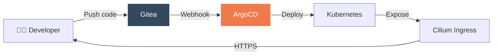

### 2. CI/CD Pipeline
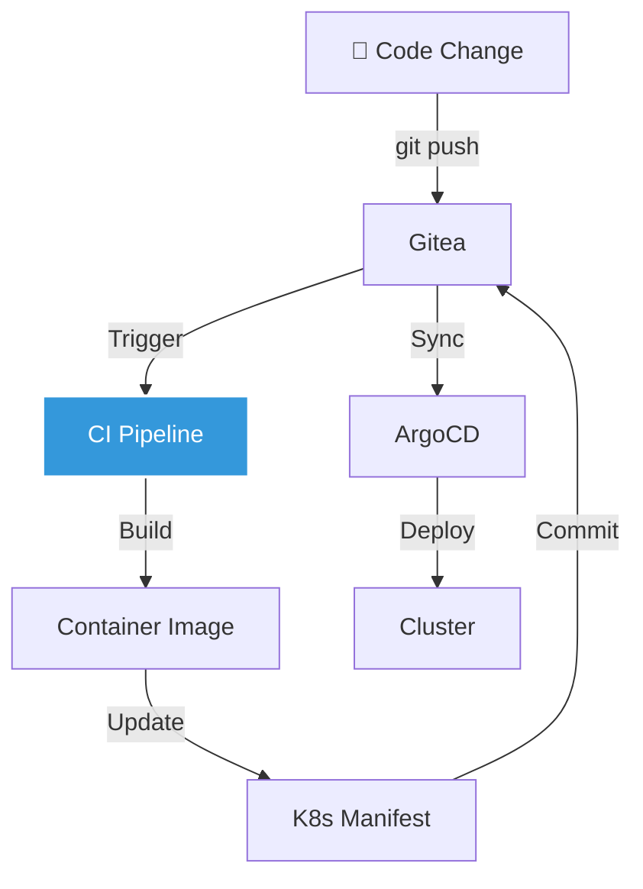

### 3. WebAssembly Apps


---

## 🔍 Monitoring et Observabilité

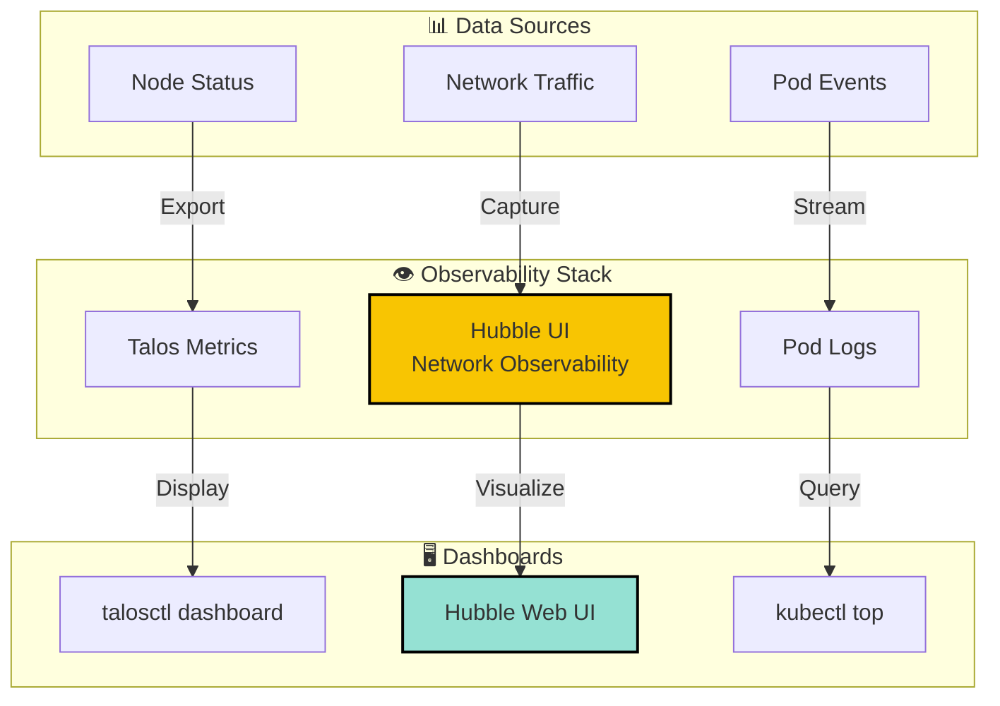

### Commandes de Monitoring

```bash
# Talos Dashboard
talosctl -n 10.17.3.80 dashboard

# Network Flow avec Hubble
cilium hubble ui

# Logs en temps réel
kubectl logs -f -n cilium -l k8s-app=cilium

# Métriques des nodes
kubectl top nodes
kubectl top pods -A
```

---

## 🛠️ Troubleshooting

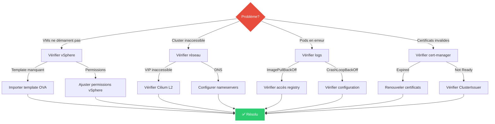

### Commandes de Debug

```bash
# Vérifier l'état du cluster Talos
talosctl -n 10.17.3.80 health
talosctl -n 10.17.3.80 services

# Vérifier les logs Kubernetes
kubectl logs -n kube-system -l k8s-app=kube-apiserver

# Vérifier Cilium
cilium status --wait
cilium connectivity test

# Vérifier les certificats
kubectl get certificates -A
kubectl describe certificate -n argocd argocd-server

# Vérifier le stockage
kubectl linstor storage-pool list
kubectl get pv,pvc -A
```

---

## 📈 Améliorations Futures

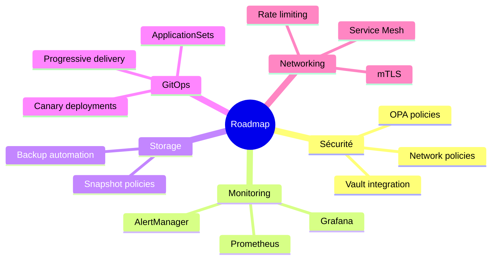

---

## 📚 Références

### Documentation Officielle
- [Talos Linux](https://www.talos.dev/)
- [Cilium](https://cilium.io/)
- [Argo CD](https://argo-cd.readthedocs.io/)
- [cert-manager](https://cert-manager.io/)
- [Piraeus](https://piraeus.io/)

### Terraform Providers
- [VMware vSphere Provider](https://registry.terraform.io/providers/vmware/vsphere/)
- [Talos Provider](https://registry.terraform.io/providers/siderolabs/talos/)
- [Helm Provider](https://registry.terraform.io/providers/hashicorp/helm/)

### Repositories GitHub
- [Talos](https://github.com/siderolabs/talos)
- [Cilium](https://github.com/cilium/cilium)
- [Argo CD Helm Chart](https://github.com/argoproj/argo-helm)
- [Piraeus Operator](https://github.com/piraeusdatastore/piraeus-operator)

---

## 👥 Contribution

Ce projet est maintenu par **ClemCreator** (cld@civadis.be).

### Comment Contribuer

1. Fork le projet
2. Créer une branche feature (`git checkout -b feature/AmazingFeature`)
3. Commit les changements (`git commit -m 'Add AmazingFeature'`)
4. Push vers la branche (`git push origin feature/AmazingFeature`)
5. Ouvrir une Pull Request

---

## 📄 License

Ce projet est basé sur le travail original de [rgl/terraform-vsphere-talos](https://github.com/rgl/terraform-vsphere-talos).

---

## 🎉 Remerciements

- **Rui Lopes (rgl)** - Projet original
- **Sidero Labs** - Talos Linux
- **Cilium Team** - Networking solution
- **CNCF** - Kubernetes ecosystem

---

<div align="center">

**🚀 Fait avec ❤️ par ClemCreator**

*Dernière mise à jour: 20 Octobre 2025*

</div>
